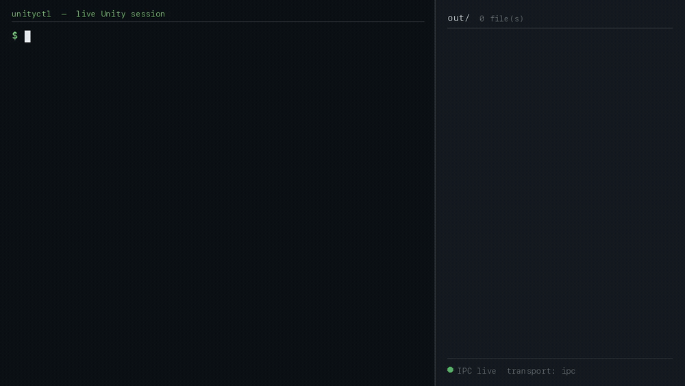
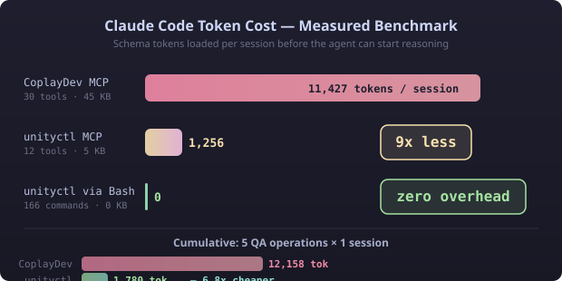

# unityctl

[English](README.md) | [한국어](README.ko.md)

[](https://www.nuget.org/packages/unityctl)
[](https://www.nuget.org/packages/unityctl-mcp)
[](https://github.com/Jason-hub-star/unityctl/actions/workflows/ci-dotnet.yml)
[](https://github.com/Jason-hub-star/unityctl/actions/workflows/ci-unity.yml)
[](LICENSE)

### The execution layer for AI-driven game development.

Give your AI agent **179 commands** to build Unity scenes, write C# scripts, validate builds, and ship games — with automatic rollback when things go wrong.

```
179 CLI commands · 12 MCP tools · 961 PR .NET tests · Windows / macOS / Linux
```

<p align="center">
  
</p>

<p align="center"><em>Unrehearsed session against a live Unity 6000.3.16f1 Editor — every command answers in structured JSON and drops an artifact in <code>out/</code>.</em></p>

Benchmarked head-to-head against the official Unity CLI (1.0.0-beta.2 + com.unity.pipeline) on the same editor session — faster round-trips, smaller responses, and every measured gap absorbed the same day. See [the benchmark](docs/contest/benchmark-vs-unity-cli.md).

| Measured (same editor, same tasks) | unityctl v0.6.0 | Official Unity CLI |
|---|---|---|
| Scene hierarchy read | **286 ms / 919 B** | 617 ms / 1,602 B |
| Play enter → console → stop | **965 ms** | 2,588 ms |
| Multi-statement C# eval | **1,755 ms** (opt-in gate) | 2,634 ms (always on) |
| Domain-reload survival (unattended) | **313–516 ms** | 739 ms |
| Unattended test run | **1 passed (4.2 s)** | false success — 0 tests ran |
| Wrong arguments | explicit failure + candidate list | silently ignored, returns success |
| Screenshot with no camera in scene | captures the view | fails |

Quality gates: every PR runs the .NET Shared/Core/Cli/Mcp test suites on Windows, macOS, and Linux. Unity Editor-dependent validation is separated into the Unity Integration workflow, with `init`, sample-project `doctor`, `check`, `scene hierarchy`, `player-settings set/get`, and `workflow verify` evidence uploaded from nightly/manual runs. Unity Integration requires either a `UNITY_LICENSE` or `UNITY_SERIAL` GitHub secret.

Contributors: see [CONTRIBUTING.md](CONTRIBUTING.md) for the test trust checklist, flaky-test policy, command sync checklist, and Unity live-validation split.

---

## The Problem

AI agents can write code, but they **can't build games** — because Unity has no programmatic interface for scene editing, asset management, or project validation.

Existing Unity MCP servers try to fix this, but they create new problems for AI agents:

| Pain Point | Impact on AI Agent |
|---|---|
| **45 KB+ schemas** loaded every turn | Wastes tokens on tool definitions instead of reasoning |
| **No validation feedback** | Agent can't tell if the scene is broken after changes |
| **No rollback** | One bad command corrupts the project state |
| **WebSocket drops on Play Mode** | Agent loses connection during Unity's Domain Reload |
| **Editor must be open** | CI/CD pipelines can't run without a GUI |

## The Solution

unityctl is a **.NET CLI + MCP server** that turns Unity Editor into a programmable API.

For AI agents, this means a **closed-loop automation cycle** — the agent doesn't just _execute_ commands, it can _verify_ results, _diagnose_ failures, and _recover_ from mistakes:

<p align="center">
  
</p>

> **Other tools give agents hands. unityctl gives agents hands, eyes, and a safety net.**

---

## Why unityctl for AI Agents?

| | unityctl | Existing Unity MCP |
|---|---|---|
| **Schema overhead** | **5 KB** per session (9x smaller) | 45 KB+ loaded every turn |
| **Validation loop** | `project validate` + `scene diff` + `screenshot capture` | Agent flies blind |
| **Error recovery** | `script get-errors` with file/line/column | Raw console output or nothing |
| **Safe experimentation** | `batch execute --rollbackOnFailure` + `undo` | No rollback — mistakes are permanent |
| **Connection stability** | Named Pipe — survives Domain Reload | WebSocket drops, reconnect needed |
| **CI/CD** | `check` / `test` / `build --dry-run` work headless | Editor must be open |
| **Diagnostics** | `doctor` classifies failures + suggests next steps | "Connection failed" |
| **Commands** | **179** (read + write + validate + diagnose) | ~34-200 tools |
| **Audit trail** | NDJSON flight recorder for every command | No history |
| **Runtime** | Native .NET — no Python/TS bridge | Bridge overhead |
| **Install** | `dotnet tool install -g unityctl` | Node.js + npm + port config |
| **License** | **MIT** | Varies |

### Token Efficiency

AI agent costs are dominated by tool schemas sent every turn. unityctl uses **on-demand schema loading**:

<p align="center">
  
</p>

The CLI exposes 179 entry points, including convenience wrappers. The 12 MCP
tools keep prompts small by loading 171 canonical command schemas on demand
through `unityctl_query`, `unityctl_run`, and `unityctl_schema`.

---

## Install

**Standalone binary — no .NET SDK required** (recommended):

```bash
# macOS (Apple Silicon) — swap in unityctl-osx-x64 / unityctl-linux-x64 as needed
curl -L https://github.com/Jason-hub-star/unityctl/releases/latest/download/unityctl-osx-arm64.tar.gz | tar xz
./unityctl --version
```

Windows: download `unityctl-win-x64.zip` from [Releases](https://github.com/Jason-hub-star/unityctl/releases/latest) and unzip.
Each archive contains a self-contained `unityctl` + `unityctl-mcp` executable and the embedded Unity plugin template.

**Or via .NET tool** (requires .NET 10 SDK):

```bash
dotnet tool install -g unityctl
dotnet tool install -g unityctl-mcp
```

Optional agent workflow skill for Claude Code and Codex:

```bash
npx skills add Jason-hub-star/unityctl \
  --skill unityctl-workflows \
  -a claude-code -a codex
```

The skill teaches agents to discover the live command surface, target the right
Unity project, and close every edit with structured readback and verification.

Bootstrap notes:
- `--source` accepts a local `Unityctl.Plugin` folder or a Git URL: `https://github.com/Jason-hub-star/unityctl.git?path=/src/Unityctl.Plugin#v0.6.4`

## Quick Start

```bash
# 1. Install the Editor plugin
unityctl init --project /path/to/project \
  --source "https://github.com/Jason-hub-star/unityctl.git?path=/src/Unityctl.Plugin#v0.6.4"

# 2. Open the project in Unity Editor, then verify connectivity
unityctl ping --project /path/to/project --json
unityctl status --project /path/to/project --json

# 3. Start building
unityctl gameobject create --name "Player" --project /path/to/project
unityctl component add --id "<PlayerId>" --type "Rigidbody" --project /path/to/project
unityctl scene save --project /path/to/project

# 4. Validate
unityctl project validate --project /path/to/project --json

# 5. Build
unityctl build --project /path/to/project --dry-run    # 13 preflight checks
```

### MCP Setup (AI Agents)

One command per client — it merges into the existing config instead of replacing it:

```bash
unityctl mcp install --client claude-code            # or cursor / codex
unityctl mcp install --client vscode --project .     # VS Code is workspace-scoped
unityctl mcp install --client cursor --dry-run       # preview, writes nothing
```

Or add it by hand:

```json
{
  "mcpServers": {
    "unityctl": {
      "command": "unityctl-mcp"
    }
  }
}
```

---

## Documentation

- [Command Reference](docs/ref/commands.md) — all 179 CLI commands and the 12 MCP tools
- [README Appendix](docs/ref/readme-appendix.md) — worked examples, architecture, platform support
- [Getting Started](docs/ref/getting-started.md) — installation, setup, and common workflows
- [AI Agent Quickstart](docs/ref/ai-quickstart.md) — MCP setup and agent integration guide
- [Showcase Roadmap](docs/ref/showcase-roadmap.md) — recommended demo game ladder, asset checklist, and pre-production plan
- [Architecture](docs/ref/architecture-mermaid.md) — system design and transport diagrams
- [Glossary](docs/ref/glossary.md) — key terms and concepts

## Changelog

See [GitHub Releases](https://github.com/Jason-hub-star/unityctl/releases) for version history.

## License

MIT — see [LICENSE](LICENSE)
