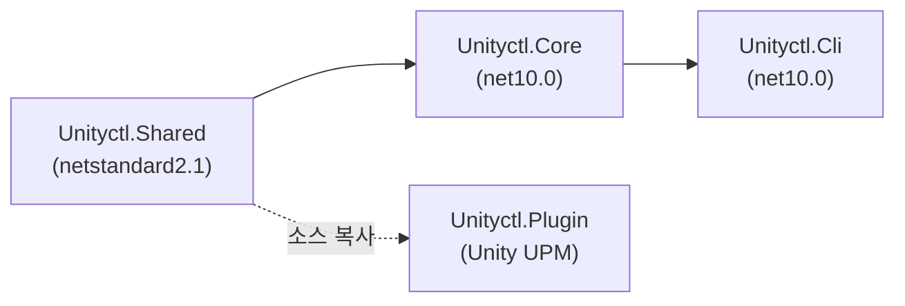
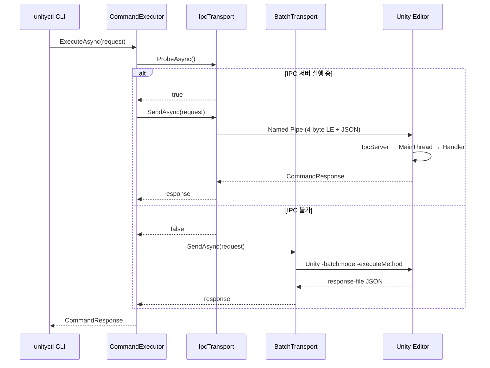

# unityctl Architecture (Quick Context)

빠른 시스템 맥락 파악용. 상세는 CLAUDE.md 참조.

## 의존성 방향



## Transport 흐름



## IPC 서버 내부 구조 (Plugin)

```mermaid
graph TD
    subgraph "Background Thread"
        Listen["ListenLoop()"]
        Pipe["NamedPipeServerStream"]
        Read["MessageFraming.ReadMessage()"]
    end

    subgraph "Main Thread (EditorApplication.update)"
        Pump["PumpMainThreadQueue()"]
        Route["IpcRequestRouter.Route()"]
        Handler["CommandHandler.Execute()"]
    end

    Listen --> Pipe --> Read
    Read -->|ConcurrentQueue| Pump
    Pump --> Route --> Handler
    Handler -->|ManualResetEventSlim.Set()| Listen
```

## 프로토콜

```
Wire Format: [4 bytes int32 LE: payload length] [N bytes UTF-8: JSON body]
Max Message: 10 MB

CommandRequest  → { command, parameters, requestId }
CommandResponse → { statusCode, success, message, data, errors, requestId }
StatusCode      → 0=Ready, 1xx=Transient, 2xx=Fatal, 5xx=Error
```

## 파이프명 생성

```
NormalizeProjectPath(path)
  → GetFullPath → Windows lowercase → \ → / → trim trailing /
GetPipeName(path)
  → SHA256(normalize(path)) → hex → "unityctl_" + first 16 chars
  → 총 25자 (예: "unityctl_a1b2c3d4e5f6a7b8")
```

## CLI 커맨드

| 커맨드 | Transport | 설명 |
|--------|-----------|------|
| `init` | 로컬 | manifest.json에 플러그인 추가 |
| `editor list` | 로컬 | 설치된 Unity Editor 목록 |
| `ping` | IPC/Batch | 에디터 연결 확인 |
| `status` | IPC/Batch | 에디터 상태 조회 |
| `check` | IPC/Batch | 컴파일 상태 확인 |
| `build` | IPC/Batch | 빌드 실행 |
| `test` | IPC/Batch | 테스트 실행 (Accepted → polling 모델) |
| `tools` | 로컬 | 도구 메타데이터 목록 |
